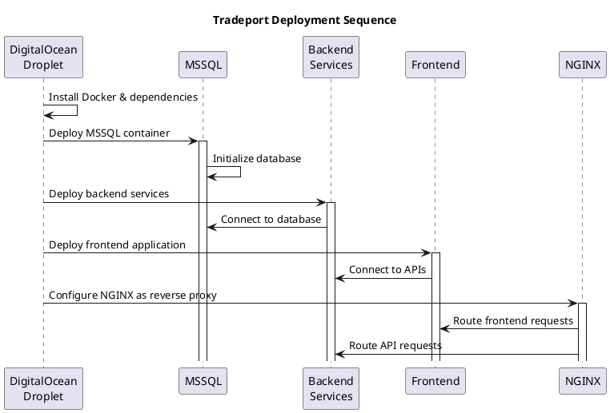

# Tradeport Deployment Guide

This guide explains how to deploy the Tradeport application stack to a DigitalOcean Droplet using Docker Compose.

## 1. Project Scope Analysis

### 1.1 Overview

Tradeport is a microservices-based e-commerce application with multiple backend services and a frontend application. This document outlines the plan to deploy this architecture to a DigitalOcean environment.

### 1.2 Architecture Diagram

```plantuml
@startuml Tradeport Architecture
!define RECTANGLE class

skinparam componentStyle rectangle
skinparam monochrome true

cloud "Internet" {
}

node "DigitalOcean Droplet" {
  RECTANGLE "NGINX\nReverse Proxy" as nginx
  RECTANGLE "Frontend\n(Node.js)" as frontend
  RECTANGLE "Identity Service\n(.NET Core)" as identity
  RECTANGLE "Product Service\n(.NET Core)" as product
  RECTANGLE "Order Service\n(.NET Core)" as order
  database "MSSQL Database" as db
}

Internet --> nginx
nginx --> frontend
nginx --> identity
nginx --> product
nginx --> order
identity --> db
product --> db
order --> db
frontend --> identity
frontend --> product
frontend --> order
@enduml
```

### 1.3 Repository Assessment

| Repository                       | Technology    | Purpose                          | Deployment Readiness |
| -------------------------------- | ------------- | -------------------------------- | -------------------- |
| tradeport-frontend               | Node.js       | User interface                   | Medium               |
| tradeport-backend-identity       | .NET 8        | Authentication & user management | Medium-High          |
| tradeport-backend-productservice | .NET 8        | Product catalog and management   | Medium-High          |
| tradeport-backend-orderservice   | .NET 8        | Order processing                 | Medium-High          |
| tradeport-backend-mssql          | MS SQL Server | Data storage                     | High                 |

### 1.4 Dependencies and Deployment Flow



## 2. Deployment Strategy

| Stage                      | Purpose                              | Approach                              | Timeline    |
| -------------------------- | ------------------------------------ | ------------------------------------- | ----------- |
| 1 - Initial Setup          | Get application running quickly      | Manual deployment with Docker Compose | Immediate   |
| 2 - Basic CI/CD            | Automate builds and deployments      | GitHub Actions workflows              | Short-term  |
| 3 - Infrastructure as Code | Automate infrastructure provisioning | Terraform and Ansible                 | Medium-term |
| 4 - Production Hardening   | Enhance security and scaling         | Advanced configurations               | Long-term   |

## 3. Deployment Stages

### Stage 1: Manual Docker Hub Deployment

Initial deployment using Docker Compose with images from Docker Hub.

### Stage 2: Automated Deployment with Terraform & Ansible

Infrastructure as code deployment with fully automated provisioning and configuration.

## Repository Analysis for Initial Deployment

Before proceeding with the deployment, let's evaluate the key repositories to understand their Docker Compose configurations and dependencies.

### tradeport-frontend Analysis

**Docker Configuration:**

- Uses Node.js Alpine image for lightweight containerization
- Exposes port 3001 for the frontend application
- Configured for development mode with hot-reloading
- Simple networking configuration that can be integrated with other services

**Strengths:**

- Lightweight container with Alpine base image
- Properly configured for development environment
- Simple network integration via `my_network`

**Improvement Areas:**

- Missing production build configuration
- No health checks configured
- Environment variables not externalized via `.env`
- No volume mounts for persistent data

**Deployment Readiness:** Medium - Can be deployed quickly but needs environment variable management improvements.

### tradeport-backend-identity Analysis

**Docker Configuration:**

- Uses .NET 8.0 SDK for build and ASP.NET runtime for execution
- Properly structured multi-stage build
- Exposes port 7237 for API endpoints
- Configured with environment variables for database connection

**Strengths:**

- Efficient multi-stage Docker build
- Clear database connectivity configuration
- Properly networked with other services

**Improvement Areas:**

- Production vs development configurations not clearly separated
- SSL certificate configuration commented out
- No health check configuration
- No dependency ordering for startup sequencing

**Deployment Readiness:** Medium-High - Well-structured but needs proper startup sequencing with the database service.

### tradeport-backend-mssql Analysis

**Docker Configuration:**

- Based on official Microsoft SQL Server image
- Configured with environment variables for SA password and EULA
- Includes custom initialization script
- Properly exposes SQL Server port 1433

**Strengths:**

- Uses official Microsoft image ensuring compatibility
- Includes database initialization for automated setup
- Appropriate port configuration
- Properly configured volumes for data persistence

**Improvement Areas:**

- Password stored directly in Docker Compose file
- No health check configuration
- Limited configuration options for SQL Server

**Deployment Readiness:** High - This is the foundation service that other services depend on and has the necessary configuration for immediate deployment.

### Integration Analysis

The three services are designed to work together with the following dependencies:

1. **Database Foundation**: `tradeport-backend-mssql` needs to be deployed first and fully initialized.
2. **Identity Service**: `tradeport-backend-identity` depends on the database service being available.
3. **Frontend Application**: `tradeport-frontend` should be configured to connect to backend services.

**Deployment Order Recommendation:**

1. Deploy and initialize `tradeport-backend-mssql`
2. Deploy `tradeport-backend-identity` after database is ready
3. Deploy `tradeport-frontend` after backend services are operational

**Integration Challenges:**

- Service discovery and networking needs configuration
- Environment variables need to be consistent across services
- No centralized API gateway for frontend-to-backend communication
- Need to ensure database initialization completes before services connect

### Consolidated Docker Compose Approach

For initial deployment, a consolidated Docker Compose file that correctly sequences these three services should be created. The composition should:

1. Start with the MSSQL database service with appropriate volume mounts
2. Include dependency ordering to ensure services start in the correct sequence
3. Configure environment variables consistently across services
4. Establish proper networking between all components

This approach will provide a solid foundation for adding additional services like the product and order services in subsequent deployments.

## Stage 1 Setup Steps

### 1. Create a DigitalOcean Droplet

1. Log in to your DigitalOcean account
2. Create a new Droplet with Ubuntu (recommended: 4GB RAM or higher)
3. Add your SSH key during creation
4. Note the IP address of your Droplet

### 2. Build & Push Docker Images to Docker Hub

```bash
# Login to Docker Hub
docker login -u YOUR_DOCKERHUB_USERNAME

# For each service, build and push with dev tag for development mode
cd tradeport-backend-mssql
docker build -t YOUR_DOCKERHUB_USERNAME/tradeport-backend-mssql:dev .
docker push YOUR_DOCKERHUB_USERNAME/tradeport-backend-mssql:dev

# Repeat for other services with dev tag:
# - tradeport-frontend:dev
# - tradeport-backend-productservice:dev
# - tradeport-backend-orderservice:dev
# - tradeport-backend-identity:dev
```

### 3. Quick Development Deployment

For a quick development deployment to demonstrate the application:

```bash
# SSH into your DigitalOcean droplet
ssh root@your_droplet_ip

# Create a project directory
mkdir -p ~/tradeport-dev
cd ~/tradeport-dev

# Create a docker-compose.dev.yml file
cat > docker-compose.dev.yml << 'EOF'
version: '3.8'

services:
  mssql:
    image: YOUR_DOCKERHUB_USERNAME/tradeport-backend-mssql:dev
    environment:
      - SA_PASSWORD=Your_password123
      - ACCEPT_EULA=Y
    ports:
      - "1433:1433"
    networks:
      - tradeport_network

  frontend:
    image: YOUR_DOCKERHUB_USERNAME/tradeport-frontend:dev
    ports:
      - "80:3001"  # Map to standard HTTP port for easy access
    environment:
      - PORT=3001
      - NODE_ENV=development
    networks:
      - tradeport_network

  productservice:
    image: YOUR_DOCKERHUB_USERNAME/tradeport-backend-productservice:dev
    environment:
      - ASPNETCORE_URLS=http://+:3016
      - ASPNETCORE_ENVIRONMENT=Development
      - DB_USER=sa
      - DB_PASSWORD=Your_password123
      - DB_SERVER=mssql
      - DB_DATABASE=tradeportdb
    ports:
      - "3016:3016"
    networks:
      - tradeport_network

  orderservice:
    image: YOUR_DOCKERHUB_USERNAME/tradeport-backend-orderservice:dev
    environment:
      - ASPNETCORE_URLS=http://+:3017
      - ASPNETCORE_ENVIRONMENT=Development
      - DB_USER=sa
      - DB_PASSWORD=Your_password123
      - DB_SERVER=mssql
      - DB_DATABASE=tradeportdb
    ports:
      - "3017:3017"
    networks:
      - tradeport_network

  identityservice:
    image: YOUR_DOCKERHUB_USERNAME/tradeport-backend-identity:dev
    environment:
      - ASPNETCORE_URLS=http://+:7237
      - ASPNETCORE_ENVIRONMENT=Development
      - DB_USER=sa
      - DB_PASSWORD=Your_password123
      - DB_SERVER=mssql
      - DB_DATABASE=tradeportdb
    ports:
      - "7237:7237"
    networks:
      - tradeport_network

networks:
  tradeport_network:
    driver: bridge
EOF

# Replace YOUR_DOCKERHUB_USERNAME with your actual Docker Hub username
sed -i "s/YOUR_DOCKERHUB_USERNAME/actual_username/" docker-compose.dev.yml

# Create Docker network
docker network create tradeport_network || true

# Pull and start containers in development mode
docker compose -f docker-compose.dev.yml pull
docker compose -f docker-compose.dev.yml up -d
```

## 4. Infrastructure as Code Implementation

### 4.1 Setting Up Infrastructure Code in Tradeport Repository

To begin implementing the infrastructure as code approach, we'll organize everything within the tradeport repository:

1. **Clean Up Existing Repositories**: The infrastructure code will replace individual repository setups.

2. **Create Core IaC Structure**: Set up the directory structure in the tradeport repository:

```bash
# Navigate to tradeport repository
cd d:\Tradeport

# Create infrastructure directory structure
mkdir -p infrastructure/{terraform,ansible,docker}
mkdir -p infrastructure/terraform/{modules,environments}
mkdir -p infrastructure/terraform/modules/{compute,network,database,security}
mkdir -p infrastructure/terraform/environments/{dev,staging,prod}
mkdir -p infrastructure/ansible/{inventory,roles,playbooks,group_vars}
mkdir -p infrastructure/ansible/roles/{common,docker,nginx,database,services}
mkdir -p infrastructure/docker/{compose,configs}
mkdir -p docs/{architecture,deployment,operations}
mkdir -p ci-cd/github-actions
```

### 4.2 Key Infrastructure Files to Create

#### 4.2.1 Terraform Configuration

Create these key Terraform files:

1. **Main Terraform Module for Droplet**:

```bash
# Create the droplet module file
cat > infrastructure/terraform/modules/compute/main.tf << 'EOF'
resource "digitalocean_droplet" "app" {
  name      = "${var.environment}-${var.name}"
  region    = var.region
  size      = var.size
  image     = var.image
  ssh_keys  = var.ssh_key_ids
  vpc_uuid  = var.vpc_id
  tags      = var.tags
}

resource "digitalocean_volume" "data" {
  name                    = "${var.environment}-${var.name}-data"
  region                  = var.region
  size                    = var.volume_size
  initial_filesystem_type = "ext4"
  description             = "Data volume for ${var.name}"
}

resource "digitalocean_volume_attachment" "data" {
  droplet_id = digitalocean_droplet.app.id
  volume_id  = digitalocean_volume.data.id
}

output "droplet_id" {
  value = digitalocean_droplet.app.id
}

output "droplet_ip" {
  value = digitalocean_droplet.app.ipv4_address
}
EOF
```

2. **Development Environment Configuration**:

```bash
# Create the dev environment configuration
cat > infrastructure/terraform/environments/dev/main.tf << 'EOF'
provider "digitalocean" {
  token = var.do_token
}

module "network" {
  source      = "../../modules/network"
  name        = "tradeport"
  region      = var.region
  environment = "dev"
}

module "app" {
  source      = "../../modules/compute"
  name        = "tradeport"
  environment = "dev"
  region      = var.region
  size        = "s-2vcpu-4gb"
  image       = "ubuntu-20-04-x64"
  ssh_key_ids = [var.ssh_key_id]
  vpc_id      = module.network.vpc_id
  volume_size = 10
  tags        = ["app", "dev", "tradeport"]
}

resource "local_file" "ansible_inventory" {
  content = templatefile("inventory.tmpl", {
    app_ip = module.app.droplet_ip
  })
  filename = "../../../ansible/inventory/dev.ini"
}
EOF
```

#### 4.2.2 Ansible Configuration

Create these key Ansible files:

1. **Main Playbook**:

```bash
# Create the main playbook
cat > infrastructure/ansible/playbooks/deploy.yml << 'EOF'
---
- name: Deploy Tradeport Infrastructure
  hosts: all
  become: true

  roles:
    - common
    - docker

- name: Deploy Tradeport Services
  hosts: all
  become: true

  roles:
    - nginx
    - database
    - services
EOF
```

2. **Docker Compose Deployment Role**:

```bash
# Create the services role for deploying Docker Compose
mkdir -p infrastructure/ansible/roles/services/tasks
cat > infrastructure/ansible/roles/services/tasks/main.yml << 'EOF'
---
- name: Ensure project directory exists
  file:
    path: /opt/tradeport
    state: directory
    mode: '0755'

- name: Copy docker-compose file
  template:
    src: docker-compose.yml.j2
    dest: /opt/tradeport/docker-compose.yml
    mode: '0644'

- name: Copy environment file
  template:
    src: env.j2
    dest: /opt/tradeport/.env
    mode: '0600'

- name: Create Docker network
  docker_network:
    name: tradeport_network
    state: present

- name: Deploy with Docker Compose
  docker_compose:
    project_src: /opt/tradeport
    state: present
    pull: yes
EOF
```

#### 4.2.3 GitHub Actions Workflow

Create a GitHub Actions workflow file:

```bash
# Create GitHub Actions workflow
mkdir -p .github/workflows
cat > .github/workflows/infrastructure.yml << 'EOF'
name: Infrastructure Deployment

on:
  push:
    branches: [main]
    paths:
      - 'infrastructure/**'
  workflow_dispatch:
    inputs:
      environment:
        description: 'Environment to deploy to'
        required: true
        default: 'dev'
        type: choice
        options:
          - dev
          - staging
          - prod

jobs:
  terraform:
    name: 'Terraform'
    runs-on: ubuntu-latest

    steps:
    - uses: actions/checkout@v3

    - name: Setup Terraform
      uses: hashicorp/setup-terraform@v2

    - name: Terraform Init
      run: |
        cd infrastructure/terraform/environments/${{ github.event.inputs.environment || 'dev' }}
        terraform init
      env:
        TF_VAR_do_token: ${{ secrets.DO_API_TOKEN }}

    - name: Terraform Plan
      run: |
        cd infrastructure/terraform/environments/${{ github.event.inputs.environment || 'dev' }}
        terraform plan -out=tfplan
      env:
        TF_VAR_do_token: ${{ secrets.DO_API_TOKEN }}
        TF_VAR_ssh_key_id: ${{ secrets.DO_SSH_KEY_ID }}

    - name: Terraform Apply
      run: |
        cd infrastructure/terraform/environments/${{ github.event.inputs.environment || 'dev' }}
        terraform apply -auto-approve tfplan
      env:
        TF_VAR_do_token: ${{ secrets.DO_API_TOKEN }}

  ansible:
    name: 'Ansible'
    needs: terraform
    runs-on: ubuntu-latest

    steps:
    - uses: actions/checkout@v3

    - name: Set up SSH key
      run: |
        mkdir -p ~/.ssh
        echo "${{ secrets.SSH_PRIVATE_KEY }}" > ~/.ssh/id_rsa
        chmod 600 ~/.ssh/id_rsa
        ssh-keyscan github.com >> ~/.ssh/known_hosts

    - name: Install Ansible
      run: |
        sudo apt update
        sudo apt install -y ansible

    - name: Run Ansible Playbook
      run: |
        cd infrastructure/ansible
        ansible-playbook -i inventory/${{ github.event.inputs.environment || 'dev' }}.ini playbooks/deploy.yml
EOF
```

### 4.3 Implementation Steps

1. **Create the directory structure** as outlined above
2. **Set up Terraform modules** for infrastructure provisioning
3. **Configure Ansible roles** for service deployment
4. **Create GitHub Actions workflows** for CI/CD automation
5. **Initialize Terraform backend** for state management
6. **Connect with DigitalOcean** using API tokens
7. **Execute the IaC pipeline** to provision infrastructure

### 4.4 Advantages of the Centralized Approach

| Advantage                       | Description                                       |
| ------------------------------- | ------------------------------------------------- |
| **Single Source of Truth**      | All infrastructure code in one repository         |
| **Simplified Management**       | Coordinate all deployments from one place         |
| **Version Control**             | Track infrastructure changes with commits         |
| **Process Standardization**     | Consistent deployment process across environments |
| **Reduced Configuration Drift** | Infrastructure templates ensure consistency       |

With this structure, we can start building out the infrastructure as code implementation while maintaining a clear separation of concerns.
